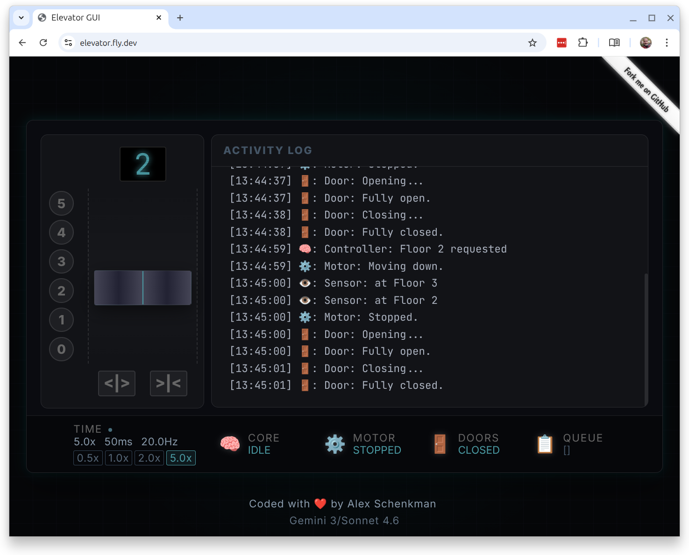
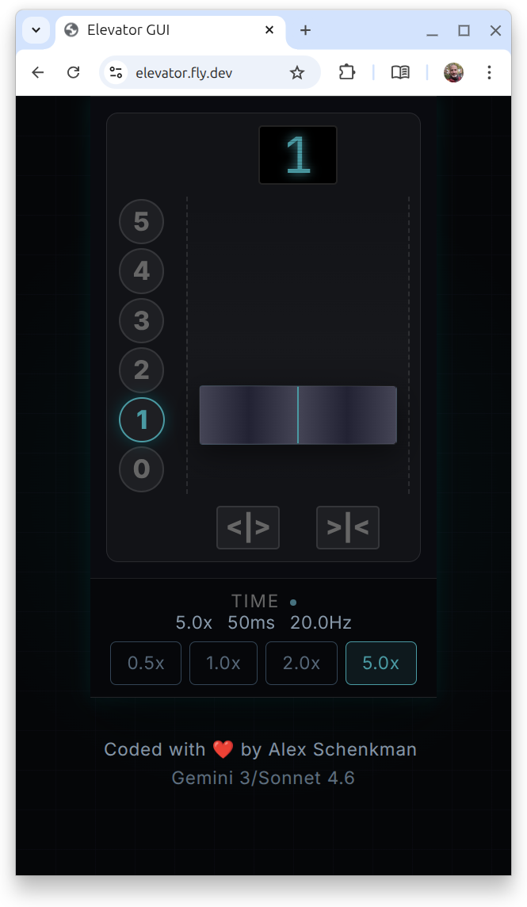

# Modelling and elevator with Elixir 

This is an elevator simulation built with **Elixir** and **Phoenix LiveView**. I've built this to learn Elixir, and got to exercise the following:
- the **Actor Model**
- a **pure functional architecture**
- Augmented AI developmen with Zed, and Sonnet 4.6 
- Multiagent orchestration with Antigravity and Gemini 3 Flash
- **BDD** with gherkin features and scenarios
- **TDD** with regular Exunit 
- End-to-end (**e2e**) testing with Playwright and ExUnit
- Continuos integration (**CI/CD**) with **Github actions**.
- Quality gates with static and security analysis (**OWASP**) 
- Deployment with **Docker** on fly.io.

---

## Live demo 
[`https://elevator.fly.dev/`](https://elevator.fly.dev/)

### Desktop version  

### Mobile version

## Specifications

All specs are inside [`doc/specs/`](doc/spec/)
- **Rules**: Business logic in [`rules.md`](doc/spec/core_rules.md).
- **Behaviors**: Observable behavior is defined in formal Gherkin feature files within the [`features/`](features/) directory.
- **Traceability**: Every test is explicitly linked to a Scenario ID (e.g., `[S-MOVE-WAKEUP]`). No code is written until a failing test proves the need for it. See [`traceability.md`](doc/specs/traceability.md)

---

## Architecture overview

The system is built around a brain containing all the logic and simple and quite dumb components collaborating through a message bus. See [`architecture.md`](doc/architecture.md)

---

## The Tech Stack

- **Elixir (OTP)**: Using lightweight processes and immutable state for concurrent fault-tolerant logic.
- **Phoenix LiveView**: A real-time, "No-Build" frontend architecture. With vanilla CSS and standard JavaScript.
- **Mise**: Automated toolchain management to ensure all developers (and agents) use the exact same versions of Elixir, Erlang, and Node.js.

---

## CI/CD & Deployment

See [`doc/ci_cd_pipeline.md`](doc/ci_cd_pipeline.md)

---

## Quality Assurance

- **ExUnit**: logic proofs for the Brain and parts of the Servo.
- **Gherkin features**: Steps imlemented with **[Cabbage](https://github.com/cabbage-ex/cabbage)** into plain ExUnit.
- **Integration testing**: A couple of tests testing all components in a fast simulation.
- **Playwright**: "Happy Path" in a real browser environment.

---

## Repository Atlas

See an overview of [all available documentation](TOC.md).

---

*Created by **Alex Schenkman**, on April 2026, and assisted by Gemini 3 and Sonnet 4.6*
