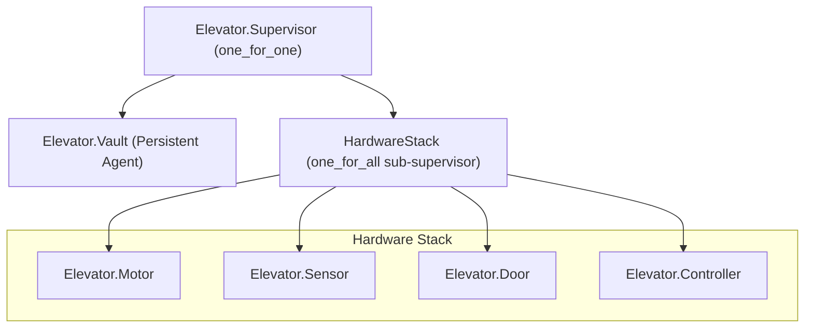
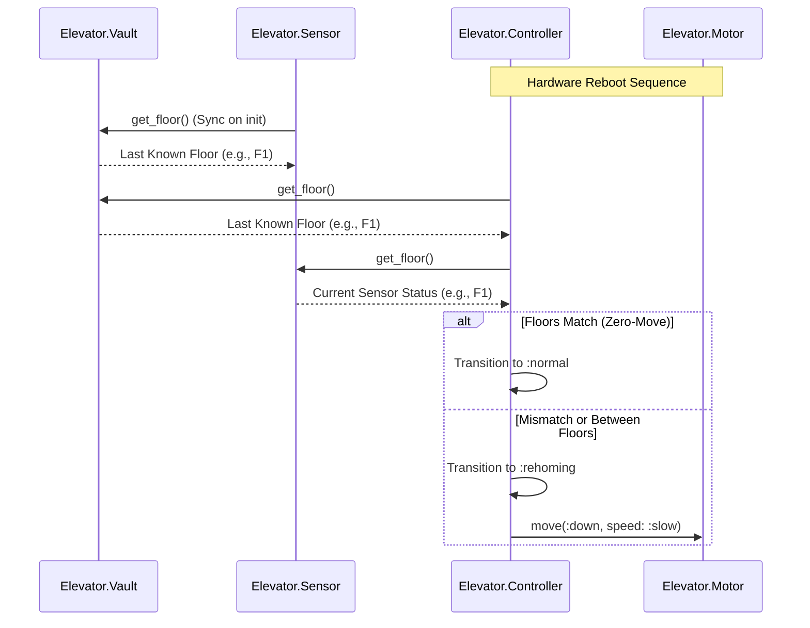
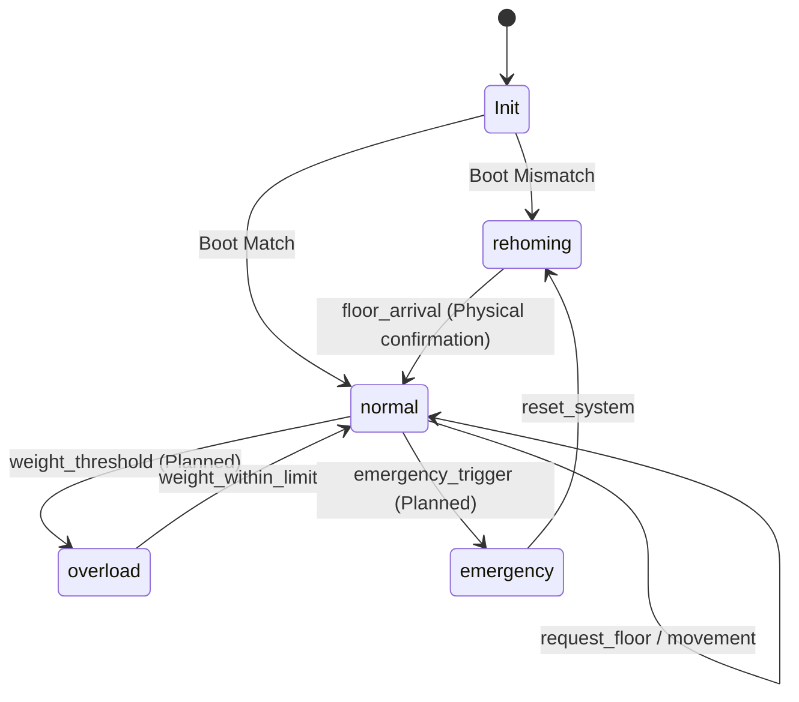

# Elevator System Architecture

This document describes the "Memory and Recovery" architecture of the elevator system, focusing on its distributed supervision and state persistence.

## 1. Supervision Tree (The Firewall Strategy)

We use a nested supervision strategy to isolate hardware-level failures from the system's "memory" (the Vault).

> [!IMPORTANT]
> The top-level `:one_for_one` strategy acts as a firewall. If the `HardwareStack` crashes (e.g., due to a door obstruction), the `Vault` process is **not** restarted, preserving the last known floor arrival.

## 2. Boot & Recovery Sequence

The system performs a "Smart Homing" check during the recovery of the Hardware Stack.

## 3. Controller State Machine

The Controller manages the functional state based on physical inputs.

## 4. Component Responsibilities

| Component | Responsibility | Failure Impact |
| :--- | :--- | :--- |
| **Vault** | Persistent storage of floor arrival | If wiped, system results in full homing from F0. |
| **Sensor** | Maps motor pulses to floors | If fails, entire Hardware Stack reboots. |
| **Controller** | Primary logic & state transitions | Manages timers and command coordination. |
| **Motor** | Physical motion execution | Supports `:normal` and `:slow` speeds. |
| **Door** | Cabin access safety | Most common source of process crashes (obstructions). |
