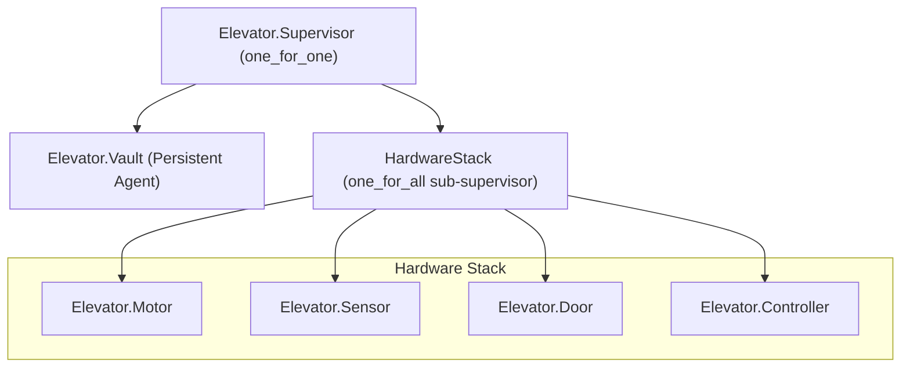

# Elevator System Architecture

This document describes the architecture of the elevator system, focusing on its distributed supervision and state persistence.

## 1. The FICS Pattern (Brain vs. Shell)

The system follows the **Functional Core, Imperative Shell (FICS)** pattern. This separates the risky, real-world interactions from the pure, safe logic.

* **The Functional Core (The Brain)**: `Elevator.Core` is a "pure" module. It does not perform any hardware I/O, network requests, or side effects. It takes a state, an event, and returns a new state.
* **The Imperative Shell (The Servo/Interface)**: `Elevator.Controller: Manages physical hardware (Motor, Doors). This is where all the "messy" real-world interaction happens. This includes:

## 2 The Web Layer (Phoenix/LiveView)
Handles user interaction and shows the elevator's status to the world in real-time.

### From the browser to the core: LiveView captures the browser events browser and calls the public API of `Elevator.Controller`.

### From the core to the browser: `Elevator.Controller` broadcasts state changes to a message bus every time the state is updated. The LiveView subscribes to this topic and updates its own state when a message is received.

## 3. Supervision Tree (The Firewall Strategy)

We use a nested supervision strategy to isolate hardware-level failures from the system's "memory" (the Vault).

> [!IMPORTANT]
> The top-level `:one_for_one` strategy acts as a firewall. If the `HardwareStack` crashes (e.g., due to a door obstruction), the `Vault` process is **not** restarted, preserving the last known floor arrival.

## 4. Component Responsibilities

| Component | Responsibility |
| :--- | :--- |
| **Time** | Ticks at a configurable rate; schedules timers for other modules. Knows nothing about elevators. |
| **World** | Simulates physical reality: given motor speed and direction, fires floor-crossing events after the appropriate number of ticks. |
| **Core** | Logical rules: state transitions and safety interlocks. Pure — no side effects. |
| **Controller** | The Servo: executes actions from Core against real hardware. |
| **Vault** | Persistent storage of last known floor. If wiped, system rehomes from F0. |
| **Motor** | Executes direction/speed commands; reports status (running, crawling, stopped). |
| **Door** | Executes open/close commands; reports status and obstruction events. |
| **Sensor** | In hardware mode: receives physical floor signals. In simulation mode: replaced by World. |

## 5. Message Bus Channels

Components communicate via Phoenix PubSub topics. No direct coupling is required between publishers and subscribers.

| Channel | Publishers | Subscribers |
| :--- | :--- | :--- |
| `"elevator:hardware"` | Motor, Door, Sensor, World | Controller, World |
| `"elevator:simulation"` | Time | World, Web Dashboard |
| `"elevator:status"` | Controller | LiveView |

> **Note:** In simulation mode, `World` publishes `{:floor_arrival, floor}` onto `"elevator:hardware"` after the appropriate number of ticks — replacing the direct Motor → Sensor pulse coupling.

## 6. Boot & Recovery Sequence

When the elevator boots up, it checks whether it knows its position.

If its memory agrees with what the floor sensor is reporting, then it acknowledges the position, opens its doors and is ready for normal service.

If the values disagree, or if either reading is missing, the elevator cannot trust its position. To find a trustable position, it moves slowly downward until a floor sensor confirms a location.

Once it has found its footing, it stops, opens its doors, and resumes normal service from there.

Either way, the startup sequence ends with open doors.

## 7. The Golden Rule

The Core enforces a hard constraint: **The motor MUST be in the `:stopped` status unless the `door_status` is confirmed to be `:closed`.**

## 8. Technical State Transition Matrix

See the table here: [states.md](./states.md)
