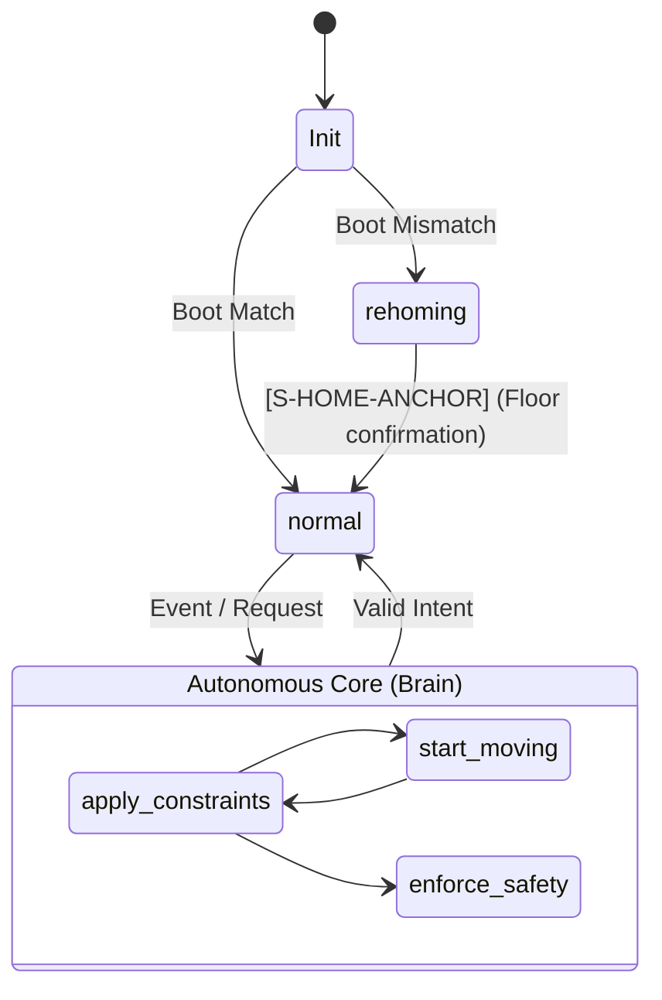
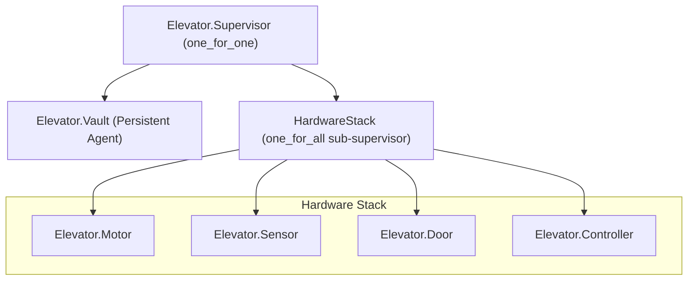
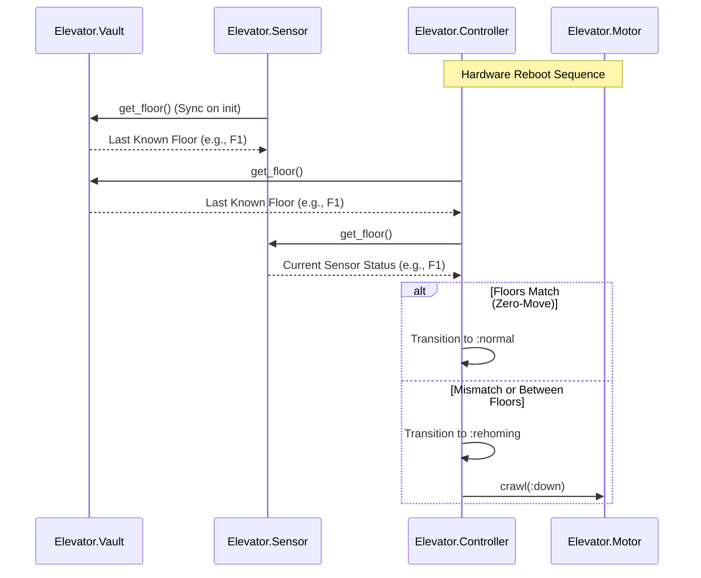

# Elevator System Architecture

This document describes the architecture of the elevator system, focusing on its distributed supervision and state persistence.

## 1. The FICS Pattern (Brain vs. Shell)

The system follows the **Functional Core, Imperative Shell (FICS)** pattern. This separates the risky, real-world interactions from the pure, safe logic.

* **The Functional Core (The Brain)**: `Elevator.Core` is a "pure" module. It does not perform any hardware I/O, network requests, or side effects. It takes a state, an event, and returns a new state.
* **The Imperative Shell (The Servo/Interface)**: This is where all the "messy" real-world interaction happens. This includes:
  * **`Elevator.Controller`**: Manages physical hardware (Motor, Doors).
  * **The Web Layer (Phoenix/LiveView)**: Handles user interaction and shows the elevator's status to the world in real-time.

### 1.1 Autonomous Core Pipeline (Decision Logic)

All decision-making logic resides in the `Elevator.Core` module's `apply_constraints/1` pipeline, which is idempotent and side-effect free.

## 2. Supervision Tree (The Firewall Strategy)

We use a nested supervision strategy to isolate hardware-level failures from the system's "memory" (the Vault).

> [!IMPORTANT]
> The top-level `:one_for_one` strategy acts as a firewall. If the `HardwareStack` crashes (e.g., due to a door obstruction), the `Vault` process is **not** restarted, preserving the last known floor arrival.

## 3. Boot & Recovery Sequence

The system performs a "Smart Homing" check during the recovery of the Hardware Stack.

## 4. Component Responsibilities

| Component | Responsibility | Failure Impact |
| :--- | :--- | :--- |
| **Vault** | Persistent storage of floor arrival | If wiped, system results in full homing from F0. |
| **Core** | **The Brain**: Autonomous logic & safety interlocks | If logic fails. |
| **Controller**| **The Servo**: Hardware mirror & change detection | If crashes, Hardware Stack reboots (Firewall). |
| **Motor** | Physical motion execution | Supports `:running` and `:crawling` statuses for REHOMING. |
| **Door** | Cabin access safety | Source of `obstruction` events for the Core. |

## 5. Safety Interlocks (Structural Safety)

Following the refactoring to an Autonomous Core, safety is no longer "checked" by the Controller; it is **structurally guaranteed** by the Core's state transition pipeline.

### 5.1 The Golden Rule

The Core enforces a hard constraint: **The motor MUST be in the `:stopped` status unless the `door_status` is confirmed to be `:closed`.**

## Technical State Transition Matrix

This table maps events to rules and state changes.

| Phase | Event | Rule | New Phase | Motor | Door |
| :--- | :--- | :--- | :--- | :--- | :--- |
| `:idle` | `{:hall, F}` or `{:car, F}` | **[R-MOVE-WAKEUP]** | `:moving` | `:running` | `:closed` |
| `:moving` | `Arrival(Target)` | **[R-SAFE-ARRIVAL]** | `:arriving` | `:stopping` | `:closed` |
| `:arriving` | `:motor_stopped` | **[R-SAFE-ARRIVAL]** | `:arriving` | `:stopped` | `:opening` |
| `:arriving` | `:door_opened` | **[R-CORE-STATE]** | `:docked` | `:stopped` | `:open` |
| `:docked` | `:door_timeout` | **[R-SAFE-TIMEOUT]** | `:leaving` | `:stopped` | `:closing` |
| `:docked` | `:door_close` | **[R-SAFE-MANUAL]** | `:leaving` | `:stopped` | `:closing` |
| `:leaving` | `:door_closed` (work) | **[R-MOVE-LOOK]** | `:moving` | `:running` | `:closed` |
| `:leaving` | `:door_closed` (idle) | **[R-MOVE-LOOK]** | `:idle` | `:stopped` | `:closed` |
| `:leaving` | `:door_obstructed` | **[R-SAFE-OBSTRUCT]** | `:arriving` | `:stopped` | `:obstructed` |
| `:rehoming` | `Init (valid floor)` | **[R-HOME-STRATEGY]** | `:idle` | `:stopped` | `:closed` |
| `:rehoming` | `Init (unknown)` | **[R-HOME-STRATEGY]** | `:rehoming` | `:crawling` | `:closed` |
| `:rehoming` | `Arrival(Any)` | **[R-HOME-STRATEGY]** | `:rehoming` | `:stopping` | `:closed` |
| `:rehoming` | `:motor_stopped` | **[R-HOME-STRATEGY]** | `:idle` | `:stopped` | `:closed` |
