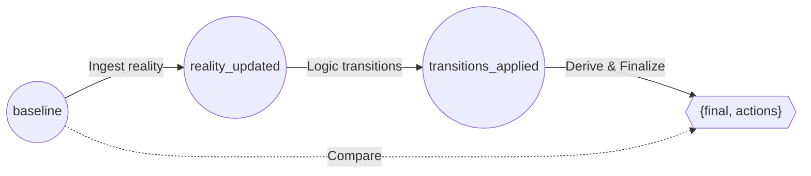

# The Pulse Machine

The **Pulse Machine** is the heart of the Elevator's Functional Core. It is responsible for transforming raw signals into logical movements and hardware commands using a deterministic, three-stage pipeline.

---

## The Pipeline

The system processes every event in a single "pulse," transforming the state through three distinct representations to produce a Pulse result.

### 1. baseline

The state of the elevator **exactly as it was** before the pulse began. It represents the "Absolute Past"—the baseline against which all changes are measured.

### 2. reality_updated

The `Ingest` layer takes the incoming signal and updates the `hardware` map.

- If the signal is `:floor_arrival`, the floor number is updated here.
- If the signal is a hall call, it is added to the request queue here.
- **reality_updated** represents the system's "Current Reality" including the new event.

### 3. transitions_applied

The `Transit` layer evaluates the **reality_updated** state to see if any logical phases should change (e.g., from `:moving` to `:arriving`).

- **transitions_applied** represents the system's "New Intention."

The final output of the pulse is a two-part bundle:

- **`final`**: The state of the elevator **after** the pulse (with signals cleared).
- **`actions`**: The list of tasks (commands) sent to the motor, door, and database.

---

## Action Derivation (The Decision)

The most critical part of the Pulse Machine is that hardware commands (Actions) are derived by comparing **baseline** and **transitions_applied**.

> **Differential Advantage**: By comparing the **baseline** (the past) to the **transitions_applied** (the present), the system can simultaneously react to both hardware changes (like floor sensor triggering) and logical phase changes (like deciding to stop the motor).

---

## Walkthrough: Arriving at the Target Floor

Consider an elevator moving up from Floor 0, tasked with stopping at Floor 3.  
A `:floor_arrival` signal for Floor 3 is received.

| Pipeline Stage | State Snapshot | Key Data |
| :--- | :--- | :--- |
| **baseline** | The state at the start of the pulse. | `phase: :moving`, `floor: 0`, `target: 3` |
| **reality_updated**| After ingestion of the arrival signal. | `phase: :moving`, **`floor: 3`**, `target: 3` |
| **transitions_applied**| After the logic transition to stop. | **`phase: :arriving`**, `floor: 3`, `target: 3` |

### The Pulse Result (baseline vs transitions_applied)

| Reconciliation Logic | Observations | Result Bundle Update |
| :--- | :--- | :--- |
| **Persistence** | `baseline.floor (0) != transitions_applied.floor (3)` | Add `{:persist_arrival, 3}` |
| **Motor Control** | `baseline.phase (:moving)` vs `transitions_applied.phase (:arriving)` | Add `{:stop_motor}` |
| **Finalization** | Cleanup of the pulse. | Produce the **`final`** state. |
