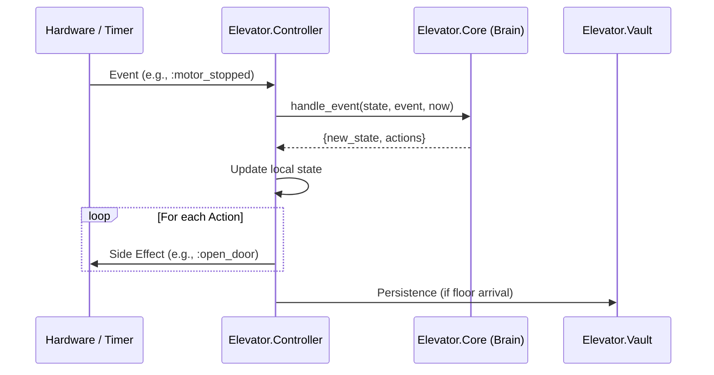

# Technical Specification: Elevator Controller (The Imperative Shell)

The `Elevator.Controller` is the **Imperative Shell** of the system. It handles concurrency, integrates with physical hardware (via drivers), manages state persistence, and executes the actions determined by the **Core (Brain)**.

## Role & Responsibilities

1. **Hardware Orchestrator**: Manages the lifecycle and communication with the Motor, Door, and Sensor.
2. **State Manager**: Maintains the running `%Elevator.Core{}` state and coordinates its updates.
3. **Action Dispatcher**: Translates declarative actions from the Core (`{:move, direction}`) into physical hardware calls.
4. **Observer & Router**: Listens for hardware events (interrupts, confirmations) and routes them into the Core.
5. **Persistence Proxy**: Updates the **`Elevator.Vault`** with the last known position on every floor arrival.

## Component Integration (FICS)

The Controller acts as the glue between the **Pure Logic** and **Side Effects**:

## Public API

### Commands (Async casts)

- `request_floor(source, floor)`: Submits a new trip request. Includes source tagging (`:car` or `:hall`).
- `open_door()`: Manual override to open the doors.
- `close_door()`: Manual override to close the doors.

### Diagnostics (Sync calls)

- `get_state()`: Returns a snapshot of the current `%Elevator.Core{}` state.
- `get_timer_ref()`: Returns the Erlang timer reference for the "Return to Base" sequence.

### System Control

- `reset()`: Destructive recovery. Clears the Vault and kills the hardware supervisor to force a full rehoming from F0.

## Hardware Discovery

The Controller uses a hybrid "Injection + Discovery" strategy:

1. **Dependency Injection**: Can be provided with specific pids/names during `init/1` (primarily for testing).
2. **Registry Lookup**: If no dependency is provided, it attempts to locate the hardware pid via the **`Elevator.Registry`**.

## Homing & Recovery Logic

Upon startup (`handle_continue`), the Controller executes a "Smart Homing" check:

- **Case 1 (Zero-Move)**: If `Vault` and `Sensor` agree on a floor, the system enters `:idle` immediately.
- **Case 2 (Physical Rehome)**: If they disagree or position is `:unknown`, the controller triggers a `:down` movement at `:crawling` speed via the Core.

## Action Materialization

| Action Variable | Execution |
| :--- | :--- |
| `{:move, dir}` | Calls `Hardware.Motor.move(pid, dir)`. |
| `{:crawl, dir}` | Calls `Hardware.Motor.crawl(pid, dir)`. |
| `{:stop_motor}` | Calls `Hardware.Motor.stop(pid)`. |
| `{:open_door}` | Calls `Hardware.Door.open(pid)`. |
| `{:close_door}` | Calls `Hardware.Door.close(pid)`. |
| `{:set_timer, id, ms}` | Executes `Process.send_after(self(), {:timeout, id}, ms)`. |
| `{:cancel_timer, id}` | *MVP Note: Currently a NO-OP. Cancellation is handled by idempotency in the Brain.* |

## Observability (Telemetry)

The Controller emits the following standard telemetry events:

- `[:elevator, :controller, :recovery]`: Emitted on successful Zero-Move recovery.
- `[:elevator, :controller, :rehoming]`: Emitted when physical homing begins.
- `[:elevator, :controller, :request]`: Emitted when a new request is successfully submitted.
- `[:elevator, :controller, :arrival]`: Emitted on every floor arrival before persistence.
