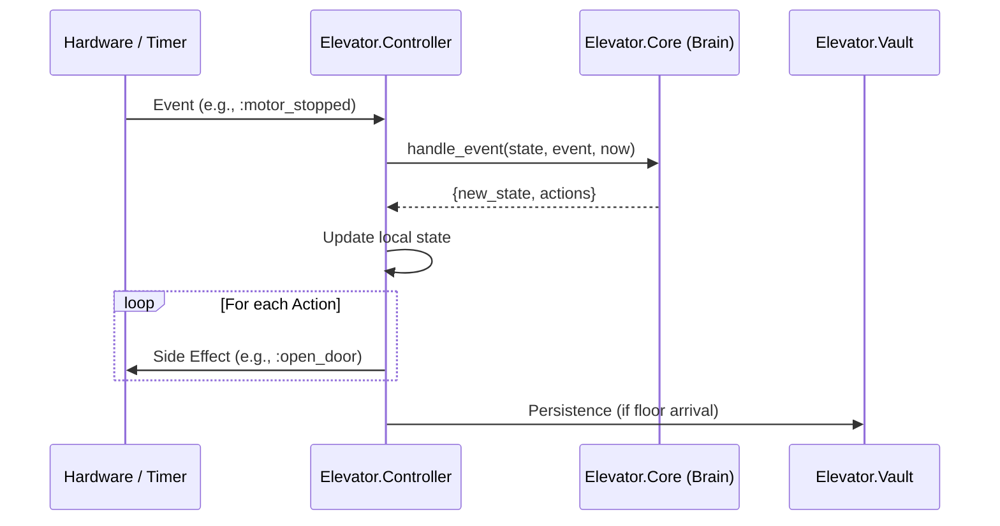

# Elevator Controller (The Imperative Shell)

The `Elevator.Controller` is the **Imperative Shell** of the system. It handles concurrency, integrates with physical hardware (via drivers), manages state persistence, and executes the actions determined by the **Core (Brain)**.

## Role & Responsibilities

1. **Hardware Orchestrator**: Manages the lifecycle and communication with the Motor, Door, and Sensor.
2. **State Manager**: Maintains the running `%Elevator.Core{}` state and coordinates its updates.
3. **Action Dispatcher**: Translates declarative actions from the Core (`{:move, direction}`) into physical hardware calls.
4. **Observer & Router**: Listens for hardware events (interrupts, confirmations) and routes them into the Core.
5. **Persistence Proxy**: Updates the **`Elevator.Vault`** with the last known position on every floor arrival.

## Component Integration (FICS)

The Controller acts as the glue between the **Pure Logic** and **Side Effects**:

## Public API

### Commands (Async casts)

- `request_floor(source, floor)`: Submits a new trip request. Includes source tagging (`:car` or `:hall`).
- `open_door()`: Manual override to open the doors.
- `close_door()`: Manual override to close the doors.

### Diagnostics (Sync calls)

- `get_state()`: Returns a snapshot of the current `%Elevator.Core{}` state.
- `get_timer_ref()`: Returns the Erlang timer reference for the "Return to Base" sequence.

### System Control

- `reset()`: Destructive recovery. Clears the Vault and kills the **`Elevator.HardwareSupervisor`**. Because of the `:one_for_all` strategy, this forces a full reboot of the hardware stack and the Controller, triggering a new rehoming sequence.

## Hardware Discovery & Architecture

The Controller uses an discovery strategy managed by the **`Elevator.HardwareSupervisor`**:

1. **Registry Lookup**: Actors (Motor, Door, Sensor) register themselves with the **`Elevator.Registry`**. The Controller performs a lookup to obtain their PIDs during command execution.
2. **Dependency Injection**: For testing, specific PIDs can still be provided during `init/1` (via the `:motor`, `:door`, etc. keys in `opts`) to bypass registry lookup.
3. **Fatal Failures**: The Hardware Supervisor uses a `:one_for_all` strategy. If any hardware actor crashes, the entire stack (including the Controller) is rebooted to ensure logical consistency.

## Homing & Recovery Logic

Upon startup (`handle_continue`), the Controller executes a "Smart Homing" check. This process is the bridge between hardware discovery and the Brain's logic:

1. **State Gating**: The system starts with the Brain in the `:booting` phase, where all external movement requests are ignored.
2. **Hardware Sync**: The Controller queries both the **`Elevator.Vault`** (persisted position) and the **`Hardware.Sensor`** (current physical position).
3. **Brain Consultation**: The hardware data is sent to the Core via the `:startup_check` event. The Core then determines whether a **Zero-Move Recovery** or **Physical Rehoming** is required.

---
> See [states.md](doc/states.md) for the detailed transition logic during the recovery sequence.
---

## Events Sent to Core

The Controller translates hardware signals and timer expirations into discrete events for the Core to process.

| Event | Condition / Source |
| :--- | :--- |
| **`:startup_check`** | Sent during `handle_continue` to verify position recovery. |
| **`:floor_arrival`** | Triggered by the physical floor sensors via `process_arrival/2`. |
| **`:motor_stopped`** | Feedback from the motor driver confirming zero velocity. |
| **`:door_opened`** | Feedback from the door driver confirming full open status. |
| **`:door_closed`** | Feedback from the door driver confirming full closed status. |
| **`:door_obstructed`** | Signal from the door safety beam (IR sensor). |
| **`:door_timeout`** | The logic-controlled timer for how long doors remain open. |
| **`:door_open`** | Manual override button from the car panel. |
| **`:door_close`** | Manual override button from the car panel. |

---

## Action Materialization

| Action Variable | Execution |
| :--- | :--- |
| `{:move, dir}` | Calls `Hardware.Motor.move(pid, dir)`. |
| `{:crawl, dir}` | Calls `Hardware.Motor.crawl(pid, dir)`. |
| `{:stop_motor}` | Calls `Hardware.Motor.stop(pid)`. |
| `{:open_door}` | Calls `Hardware.Door.open(pid)`. |
| `{:close_door}` | Calls `Hardware.Door.close(pid)`. |
| `{:set_timer, id, ms}` | Executes `Process.send_after(self(), {:timeout, id}, ms)`. |
| `{:cancel_timer, id}` | *MVP Note: Currently a NO-OP. Cancellation is handled by idempotency in the Brain.* |

## Observability (Telemetry)

The Controller emits the following standard telemetry events:

- `[:elevator, :controller, :recovery]`: Emitted on successful Zero-Move recovery.
- `[:elevator, :controller, :rehoming]`: Emitted when physical homing begins.
- `[:elevator, :controller, :request]`: Emitted when a new request is successfully submitted.
- `[:elevator, :controller, :arrival]`: Emitted on every floor arrival before persistence.
