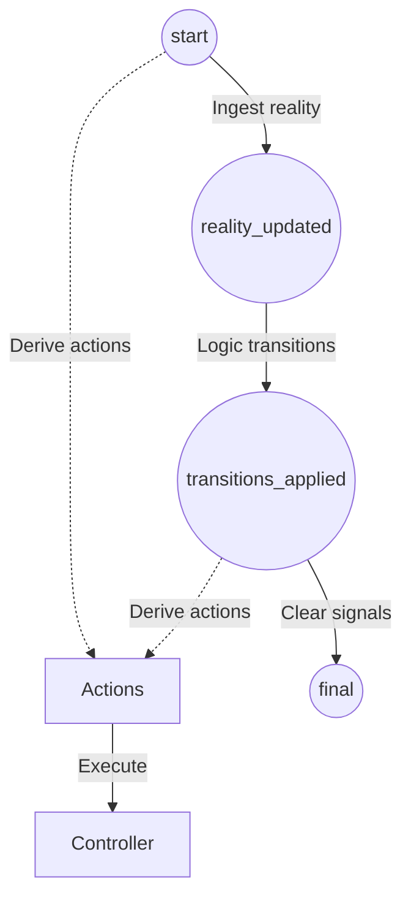

# The Pulse Machine

The **Pulse Machine** is the heart of the Elevator's Functional Core. It is responsible for transforming raw signals into logical movements and hardware commands using a deterministic, three-stage pipeline.

---

## The Pipeline

The system processes every event in a single "pulse," transforming the state through three distinct representations before deciding which actions to take.

### 1. start
This is the state of the elevator **before** the pulse begins. It represents the "Absolute Past"—the reality as it was known just a millisecond ago.

### 2. reality_updated
The `Ingest` layer takes the incoming signal and updates the `hardware` map.
- If the signal is `:floor_arrival`, the floor number is updated here.
- If the signal is a hall call, it is added to the request queue here.
- **reality_updated** represents the system's "Current Reality" including the new event.

### 3. transitions_applied
The `Transit` layer evaluates the **reality_updated** state to see if any logical phases should change.
- If the current floor matches the target floor, the phase changes from `:moving` to `:arriving`.
- **transitions_applied** represents the system's "New Intention."

---

## Action Derivation (The Decision)

The most critical part of the Pulse Machine is that hardware commands (Actions) are derived by comparing **start** and **transitions_applied**. 

By looking at the delta between the **Absolute Past** and the **New Intention**, the system can detect exactly which side effects are required.

> **Differential Advantage**: Comparing **start** to **transitions_applied** allows the system to react to hardware changes (ingested in `reality_updated`) and logic changes (decided in `transitions_applied`) simultaneously. 

---

## Walkthrough: Arriving at the Target Floor

Consider an elevator moving up from Floor 0, tasked with stopping at Floor 3.  
A `:floor_arrival` signal for Floor 3 is received.

| Pipeline Stage | State Snapshot | Key Data |
| :--- | :--- | :--- |
| **start** | The baseline at the beginning. | `phase: :moving`, `floor: 0`, `target: 3` |
| **reality_updated**| After ingestion. | `phase: :moving`, **`floor: 3`**, `target: 3` |
| **transitions_applied**| After logic transitions. | **`phase: :arriving`**, `floor: 3`, `target: 3` |

### Derived Actions (start vs transitions_applied)

| Reconciliation Logic | Observations | Action Generated |
| :--- | :--- | :--- |
| **Persistence** | `start.floor (0) != transitions_applied.floor (3)` | `{:persist_arrival, 3}` |
| **Motor Control** | `start.phase (:moving)` vs `transitions_applied.phase (:arriving)` | `{:stop_motor}` |

**Pulse Result**: In a single pulse, the elevator records its arrival in the database and shuts off the motor.

---

## Why skip reality_updated for Derivation?

If we derived actions by comparing **reality_updated** and **transitions_applied**, the system would be "blind" to the hardware updates that happened during ingestion. 

In the example above, **reality_updated** and **transitions_applied** both have `floor: 3`. A comparison would conclude that no floor change occurred during this pulse, and it would **forget to persist the arrival** to the database. By using **start**, we ensure every physical change is reconciled with the outside world.
