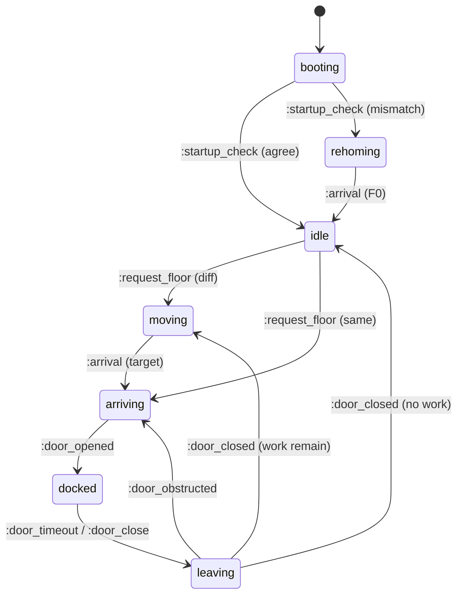

# Elevator States & Transitions Ledger

This document is the **Single Source of Truth** for all operational phases and state transitions of the Elevator.

## Operational Phases

| Phase | Description | Motor | Door |
| :--- | :--- | :--- | :--- |
| **`:booting`** | Initial synchronization; waiting for hardware discovery. External requests are ignored. | `:stopped` | `:closed` |
| **`:idle`** | At floor, stationary, no active work. | `:stopped` | `:closed` |
| **`:rehoming`** | Recovering position by moving down slowly to Ground Floor (F0). | `:crawling` | `:closed` |
| **`:moving`** | Traveling toward a target floor at normal speed. | `:running` | `:closed` |
| **`:arriving`** | Target reached: motor braking and/or door opening sequence. | `:stopping` | `:opening` |
| **`:docked`** | At floor, doors confirmed open, serving passengers. | `:stopped` | `:open` |
| **`:leaving`** | Service complete: doors are confirmed closing. | `:stopped` | `:closing` |

---

## The Transition Ledger (SECA)

Formal definition of state changes based on **State, Event, Condition, and Action**.

| Current State | Event (Trigger) | Condition | Action (Effect) | Next State |
| :--- | :--- | :--- | :--- | :--- |
| **`:booting`** | `:startup_check` | `vault == sensor` | None | **`:idle`** |
| **`:booting`** | `:startup_check` | `vault != sensor` | `{:crawl, :down}` | **`:rehoming`** |
| **`:rehoming`** | `:arrival` | `floor == 0` | `{:stop_motor}` | **`:idle`** |
| **`:idle`** | `:request_floor` | `target == current` | `{:open_door}` | **`:arriving`** |
| **`:idle`** | `:request_floor` | `target != current` | `{:move, dir}` | **`:moving`** |
| **`:moving`** | `:arrival` | `floor == target` | `{:stop_motor}` | **`:arriving`** |
| **`:arriving`** | `:motor_stopped`| Only if FICS derived | `{:open_door}` | **`:arriving`** |
| **`:arriving`** | `:door_opened` | None | `{:set_timer, :door_timeout}` | **`:docked`** |
| **`:docked`** | `:door_timeout` | None | `{:close_door}` | **`:leaving`** |
| **`:docked`** | `:door_close` | None | `{:close_door}` | **`:leaving`** |
| **`:leaving`** | `:door_closed` | `requests.empty?` | None | **`:idle`** |
| **`:leaving`** | `:door_closed` | `not requests.empty?` | `{:move, dir}` | **`:moving`** |
| **`:leaving`** | `:door_obstructed`| None | `{:open_door}` | **`:arriving`** |

---

## Startup Flow (:startup_check)

The transition from `:booting` is managed by the "Smart Homing" sequence:

1. **Comparison**: The Controller provides both the `Vault` floor (persisted) and the `Hardware.Sensor` floor.
2. **Logic**:
    - If they match (and are not `:unknown`), the Brain determines it is a safe recovery and signals `:recovery_complete`.
    - If they mismatch or are `:unknown`, the Brain triggers `:rehoming_started`.

---

## State Diagram (Visual Reference)

